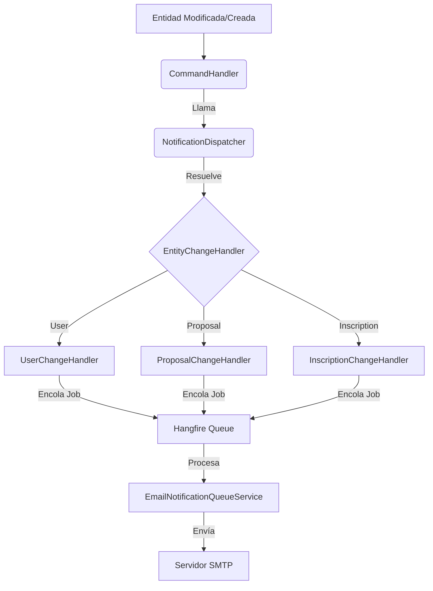

# Sistema de Notificaciones

## 🏗️ Arquitectura General

El sistema de notificaciones utiliza un enfoque desacoplado basado en eventos, implementando los principios SOLID para garantizar extensibilidad y mantenibilidad.

### Diagrama Conceptual

## 🧱 Componentes Principales

### 1. Domain Layer (Interfaces)
- **`INotificationDispatcher`**: Interfaz para el despachador principal.
- **`IEntityChangeHandler<T, TId>`**: Contrato que deben cumplir los manejadores de notificaciones por entidad.
- **`IEventDataBuilder`**: Interfaces para construir los diccionarios de datos requeridos por las plantillas de correo.

### 2. Application Layer (Implementación)
- **`NotificationDispatcher`**: El corazón del sistema. Utiliza `IServiceScopeFactory` para crear un ámbito independiente y resolver dinámicamente el handler adecuado según el tipo de entidad.
- **Handlers Específicos**: Clases como `ProposalChangeHandler` o `InscriptionChangeHandler` que contienen la lógica de negocio para determinar cuándo enviar una notificación (ej. cambio de estado).

### 3. Infrastructure Layer
- **`EmailNotificationQueueService`**: Servicio integrado con Hangfire para el procesamiento asíncrono de correos.

## 🔄 Flujo de Ejecución

1. **Origen**: Un CommandHandler (ej. `UpdateProposalHandler`) invoca al `NotificationDispatcher` después de persistir cambios.
2. **Dispatch**: El Dispatcher identifica el tipo de entidad y busca en el contenedor de inyección de dependencias un `IEntityChangeHandler` compatible.
3. **Handling**: El Handler específico evalúa las condiciones (ej. `oldState != newState`).
4. **Data Building**: Si se requiere notificación, se usa un `EventDataBuilder` para recopilar información (nombres, fechas, correos).
5. **Queuing**: Se encola un trabajo en Hangfire con el nombre del evento (ej. `PROPOSAL_SUBMITTED`) y los datos.
6. **Delivery**: Hangfire procesa el trabajo y envía el correo usando la configuración SMTP.

## 🛠️ Extensibilidad

Para agregar notificaciones a una nueva entidad, consulte la **[Guía de Extensión](GUIA_EXTENSION.md)**.

## 🚨 Solución de Problemas Comunes

### ObjectDisposedException
- **Causa**: Uso de `DbContext` o servicios Scoped dentro de un contexto que ya finalizó.
- **Solución**: El `NotificationDispatcher` crea su propio `IServiceScope`. Asegúrese de no pasar instancias de DbContext desde el controlador al dispatcher.

### Handler no encontrado
- **Causa**: No existe una clase que implemente `IEntityChangeHandler<Entidad, TipoId>`.
- **Solución**: Cree el handler y asegúrese de que la interfaz herede de `IScopedService` para el auto-registro.

### Correos no enviados
- **Causa**: Fallo en SMTP o Hangfire.
- **Solución**: Revise el Dashboard de Hangfire (`/hangfire`) y los logs de la aplicación.
